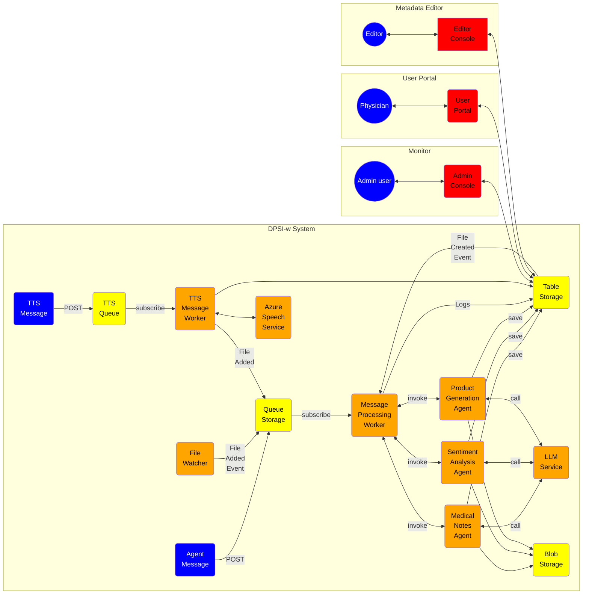

# ZionAI MedFlow: Streamlining Healthcare with Intelligent Automation

Transform your medical practice with Zion MedFlow GenAI, an advanced workflow automation solution designed to make your clinic more efficient and patient-centric. This powerful system seamlessly integrates with your existing tools and processes to intelligently manage, process, and analyze critical patient data in real-time.

At its core, Zion MedFlow GenAI features a Worker module that captures patient information from various sources like electronic health records (EHR), lab results, and imaging systems. The data is intelligently filtered and processed to ensure compliance with medical standards, and then routed to the right person or system—whether it’s updating patient charts, triggering alerts, or scheduling follow-ups.

The system also includes a Patient Profile Loader that effortlessly pulls up-to-date patient records, while a built-in Transcription Service automates the time-consuming task of managing clinical notes. With the Admin Console, your team can monitor the system’s performance, ensuring everything runs smoothly, and doctors gain instant access to a user-friendly Physician Portal where they can quickly review patient data and take action.

Need to update patient details or adjust workflows on the fly? The Metadata Editor empowers your staff to make changes in real-time, ensuring your practice is always running at peak efficiency.

Zion MedFlow GenAI is simple to implement and customize. Our development-friendly environment makes setup a breeze—just clone the repository, configure your settings, and run the solution in Visual Studio Code. Your clinic will be up and running with intelligent workflow automation in no time.

# Distributed Processing System For Intelligent Workloads (DPSIw)

This prototype system is a distributed application that utilizes various components to process and analyze messages. It consists of a Worker module that receives messages from different sources such as file watchers and blob storage events. These messages are then processed by message processing workers, which apply content filters and interact with services and tools. The system also includes a Metadata Loader that interacts with a Profile Loader and Transcription Service. Additionally, there is a Monitor module that provides an admin console for managing the system, a User Portal for physicians to access the system, and a Metadata Editor for editors to make changes. 

The prototype environment relies on Azure Storage Emulator for development and requires specific environment variables to be set. To run the system, the repository needs to be cloned, an environment file created, and a virtual Python environment set up. Finally, the solution can be opened in VS Code and executed. 

## Application Architecture Diagram


## Development

### Development dependecies

In development this application makes use of the Azure Storage Emulator.

- Starting the storage emulator with persistance

```bash
docker run --rm -d \
    -p 10000:10000 -p 10001:10001 -p 10002:10002 \
    -v /home/alex/containers/azurestorage:/data \
    mcr.microsoft.com/azure-storage/azurite
```

- Starting the storage emulator with persistance

```bash
docker run --rm -d \
    -p 10000:10000 -p 10001:10001 -p 10002:10002 \
    mcr.microsoft.com/azure-storage/azurite
```

### Development enviroment

- Clone the repo: `git clone https://github.com/am8850/zebra.git` 
- Change directories: `cd zebra`
- create an `.env` file:

```bash
TABLE_CONNECTION_STRING=<CONNECTION_STRING>
QUEUE_CONNECTION_STRING=<CONNECTION_STRING>
STORAGE_CONNECTION_STRING=<CONNECTION_STRING>
TYPE=azure
CHAT_MODEL=gpt-4o
ENDPOINT=<ENDPOINT>
API_KEY=<API_KEY>
VERSION=2024-02-15-preview
```

- Create a Virtual Python >3.10 Enviornment: `python -m venv .venv`
- Activate the Python environment: `source .venv\bin\activate`
- Open the solution in VS Code: `code .`
- Open the file: `dpsiw/cmd/root.py`
- Hit the play button

### Full run

```bash
dpsiw qclear
dpsiw mt-rm
dpsiw produce -n "${1:-1}"
dpsiw consume
dpsiw mt-ls
```
