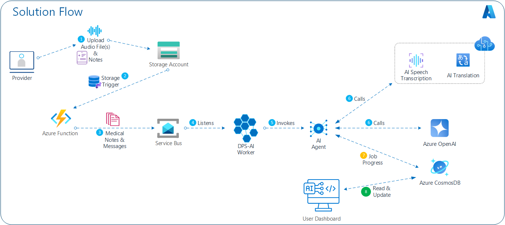

# ZionAI MedFlow: Streamlining Healthcare with Intelligent Automation

Transform your medical practice with Zion MedFlow GenAI, an advanced workflow automation solution designed to make your clinic more efficient and patient-centric. This powerful system seamlessly integrates with your existing tools and processes to intelligently manage, process, and analyze critical patient data in real-time.

At its core, Zion MedFlow GenAI features a Worker module that captures patient information from various sources like electronic health records (EHR), lab results, and imaging systems. The data is intelligently filtered and processed to ensure compliance with medical standards, and then routed to the right person or system—whether it’s updating patient charts, triggering alerts, or scheduling follow-ups.

The system also includes a Patient Profile Loader that effortlessly pulls up-to-date patient records, while a built-in Transcription Service automates the time-consuming task of managing clinical notes. With the Admin Console, your team can monitor the system’s performance, ensuring everything runs smoothly, and doctors gain instant access to a user-friendly Physician Portal where they can quickly review patient data and take action.

Need to update patient details or adjust workflows on the fly? The Metadata Editor empowers your staff to make changes in real-time, ensuring your practice is always running at peak efficiency.

Zion MedFlow GenAI is simple to implement and customize. Our development-friendly environment makes setup a breeze—just clone the repository, configure your settings, and run the solution in Visual Studio Code. Your clinic will be up and running with intelligent workflow automation in no time.

<a href="https://codeclimate.com/github/ZionClouds/ZionAIMedFlow" target="_blank">
  
</a>


### Architecture Diagram

<p align="center">

</p>


# Distributed Processing System For Intelligent Workloads (DPSIw)

This prototype system is a distributed application that utilizes various components to process and analyze messages. It consists of a Worker module that receives messages from different sources such as file watchers and blob storage events. These messages are then processed by message processing workers, which apply content filters and interact with services and tools. The system also includes a Metadata Loader that interacts with a Profile Loader and Transcription Service. Additionally, there is a Monitor module that provides an admin console for managing the system, a User Portal for physicians to access the system, and a Metadata Editor for editors to make changes.

The prototype environment relies on Azure Storage Emulator for development and requires specific environment variables to be set. To run the system, the repository needs to be cloned, an environment file created, and a virtual Python environment set up. Finally, the solution can be opened in VS Code and executed.


## Features

The project template provides the following features:

- [Azure OpenAI](https://learn.microsoft.com/azure/ai-services/openai/) for embeddings, chat, and evaluation models
- [Azure AI Search](https://azure.microsoft.com/products/ai-services/ai-search) for performing semantic similarity search
- [Azure Container Apps](https://learn.microsoft.com/azure/container-apps/overview) for hosting the chat AI endpoint on Azure

It also comes with:
- Sample product and customer data for rapid prototyping
- Sample datasets and custom evaluators
- Integrates Azure AI Search for indexing and retrieval of documents

## Pre-requisites

To deploy and explore the sample, you will need:

1. An active Azure subscription - [Signup for a free account here](https://azure.microsoft.com/free/)
1. Access to Azure OpenAI Services - [Learn about Limited Access here](https://learn.microsoft.com/legal/cognitive-services/openai/limited-access)
1. Available Quota for: `text-embedding-ada-002` and `gpt-4o`

We recommend deployments to `eastus` or `swedencentral` as regions that can support all these models. In addition to the above, you will also need the ability to:
 - provision Azure Monitor (free tier)
 - provision Azure Container Apps (free tier)

From a tooling perspective, familiarity with the following is useful:
 - Visual Studio Code (and extensions)
 - Python and Jupyter Notebooks
 - Azure CLI, Azure Developer CLI and commandline usage

## Solution Deployment
The sample illustrates the end-to-end workflow (GenAIOps) for building a RAG-based application **code-first** with Azure AI. By exploring and deploying this sample, you will learn to:

1. Deploy and use [Azure OpenAI](https://learn.microsoft.com/azure/ai-services/openai/) models for chat, embeddings and evaluation
1. Host the application as a FastAPI endpoint deployed to Azure Container Apps
1. Provision and deploy the solution using the Azure Developer CLI
1. Support Responsible AI practices with content safety & assessments


## Deployment Wizard

First create an Azure Entra Service Principal that will be used for User Authentication (Easy Auth):

  ```PowerShell
  .\infra\hooks\CreateAppRegistration.ps1 -AppName app-yak
  ```

The result of the script will give you an output like this:

  ```json
  {
    "appId": "xxxxxxxx-xxxx-xxxx-xxxx-xxxxxxxxxxxx",
    "displayName": "app-yak",
    "password": "*************************************",
    "tenant": "xxxxxxxx-xxxx-xxxx-xxxx-xxxxxxxxxxxx"
  }
  ```

Save the output, it will be used during the deployment.

## Deploying through azd

Follow these steps to provision Azure resources and deploy the application code:

1. Clone this repo locally to your machine

    ```shell
    git clone https://github.com/ZionClouds/ZionDataFusionAI
    ```

1. Login to your Azure account:

    ```shell
    azd auth login --use-device-code
    ```

    ```shell
    az login --use-device-code
    ```

1. Create a new azd environment:

    ```shell
    azd env new
    ```

    Enter a name that will be used for the resource group.
    This will create a new folder in the `.azure` folder, and set it as the active environment for any calls to `azd` going forward.
1. (Optional) This is the point where you can customize the deployment by setting environment variables, in order to [use existing resources](docs/deploy_existing.md), [enable optional features (such as auth or vision)](docs/deploy_features.md), or [deploy to free tiers](docs/deploy_lowcost.md).

1. Run `azd up` - This will provision Azure resources and deploy this sample to those resources, including building the search index based on the files found in the `./data` folder.
    - **Important**: Beware that the resources created by this command will incur immediate costs, primarily from the AI Search resource. These resources may accrue costs even if you interrupt the command before it is fully executed. You can run `azd down` or delete the resources manually to avoid unnecessary spending.
    - You will be prompted to select two locations, one for the majority of resources and one for the OpenAI resource, which is currently a short list. That location list is based on the [OpenAI model availability table](https://learn.microsoft.com/azure/cognitive-services/openai/concepts/models#model-summary-table-and-region-availability) and may become outdated as availability changes.

> NOTE: It may take 5-10 minutes after you see 'SUCCESS' for the application to be fully deployed. If you see a "Python Developer" welcome screen or an error page, then wait a bit and refresh the page. See [guide on debugging App Service deployments](docs/appservice.md).

At the end run the script SetupAppRegistration.ps1 in a PowerShell session to finish the App Registration setup. Pass the parameter -AppId as the "appId" from the output of CreateAppRegistration.ps1 and -ACAFrontEndUrl from the Azure Container Apps URL it can be captured at the end of the deployment under output tabs or by browsing the resource group and looking for the Azure Container Apps with a name like "yak-xxxxxxxxxxxxx-ca":

```powershell
.\infra\hooks\SetupAppRegistration.ps1 -AppId "xxxxxxxx-xxxx-xxxx-xxxx-xxxxxxxxxxxx" -ACAFrontEndUrl "https://yak-xxxxxxxxxxxxx-ca.xxxxxxxxxxxx-xxxxxxxx.<region>.azurecontainerapps.io"
```

In case you are running from a Linux environment

```powershell
.\infra\hooks\SetupAppRegistrationLinux.ps1 -AppId "xxxxxxxx-xxxx-xxxx-xxxx-xxxxxxxxxxxx" -ACAFrontEndUrl "https://yak-xxxxxxxxxxxxx-ca.xxxxxxxxxxxx-xxxxxxxx.<region>.azurecontainerapps.io"
```

## Deployment Wizard

First create an Azure Entra Service Principal that will be used for User Authentication (Easy Auth):

## Deploying through azd

Follow these steps to provision Azure resources and deploy the application code:

1. Clone this repo locally to your machine

    ```shell
    git clone https://github.com/ZionClouds/ZionDataFusionAI
    ```

1. Login to your Azure account:

    ```shell
    azd auth login --use-device-code
    ```

    ```shell
    az login --use-device-code
    ```

1. Create a new azd environment:

    ```shell
    azd env new
    ```

    Enter a name that will be used for the resource group.
    This will create a new folder in the `.azure` folder, and set it as the active environment for any calls to `azd` going forward.
1. (Optional) This is the point where you can customize the deployment by setting environment variables, in order to [use existing resources](docs/deploy_existing.md), [enable optional features (such as auth or vision)](docs/deploy_features.md), or [deploy to free tiers](docs/deploy_lowcost.md).

1. Run `azd up` - This will provision Azure resources and deploy this sample to those resources, including building the search index based on the files found in the `./data` folder.
    - **Important**: Beware that the resources created by this command will incur immediate costs, primarily from the AI Search resource. These resources may accrue costs even if you interrupt the command before it is fully executed. You can run `azd down` or delete the resources manually to avoid unnecessary spending.
    - You will be prompted to select two locations, one for the majority of resources and one for the OpenAI resource, which is currently a short list. That location list is based on the [OpenAI model availability table](https://learn.microsoft.com/azure/cognitive-services/openai/concepts/models#model-summary-table-and-region-availability) and may become outdated as availability changes.

> NOTE: It may take 5-10 minutes after you see 'SUCCESS' for the application to be fully deployed. If you see a "Python Developer" welcome screen or an error page, then wait a bit and refresh the page. See [guide on debugging App Service deployments](docs/appservice.md).


## Development

### Development dependecies

In development this application makes use of the Azure Storage Emulator.

- Starting the storage emulator with persistance

```bash
docker run --rm -d \
    -p 10000:10000 -p 10001:10001 -p 10002:10002 \
    -v /home/alex/containers/azurestorage:/data \
    mcr.microsoft.com/azure-storage/azurite
```

- Starting the storage emulator with persistance

```bash
docker run --rm -d \
    -p 10000:10000 -p 10001:10001 -p 10002:10002 \
    mcr.microsoft.com/azure-storage/azurite
```

### Development enviroment

- Clone the repo: `git clone https://github.com/am8850/zebra.git`
- Change directories: `cd zebra`
- create an `.env` file:

```bash
TABLE_CONNECTION_STRING=<CONNECTION_STRING>
QUEUE_CONNECTION_STRING=<CONNECTION_STRING>
STORAGE_CONNECTION_STRING=<CONNECTION_STRING>
TYPE=azure
CHAT_MODEL=gpt-4o
ENDPOINT=<ENDPOINT>
API_KEY=<API_KEY>
VERSION=2024-02-15-preview
```

- Create a Virtual Python >3.10 Enviornment: `python -m venv .venv`
- Activate the Python environment: `source .venv\bin\activate`
- Open the solution in VS Code: `code .`
- Open the file: `dpsiw/cmd/root.py`
- Hit the play button

### Full run

```bash
dpsiw qclear
dpsiw mt-rm
dpsiw produce -n "${1:-1}"
dpsiw consume
dpsiw mt-ls
```
