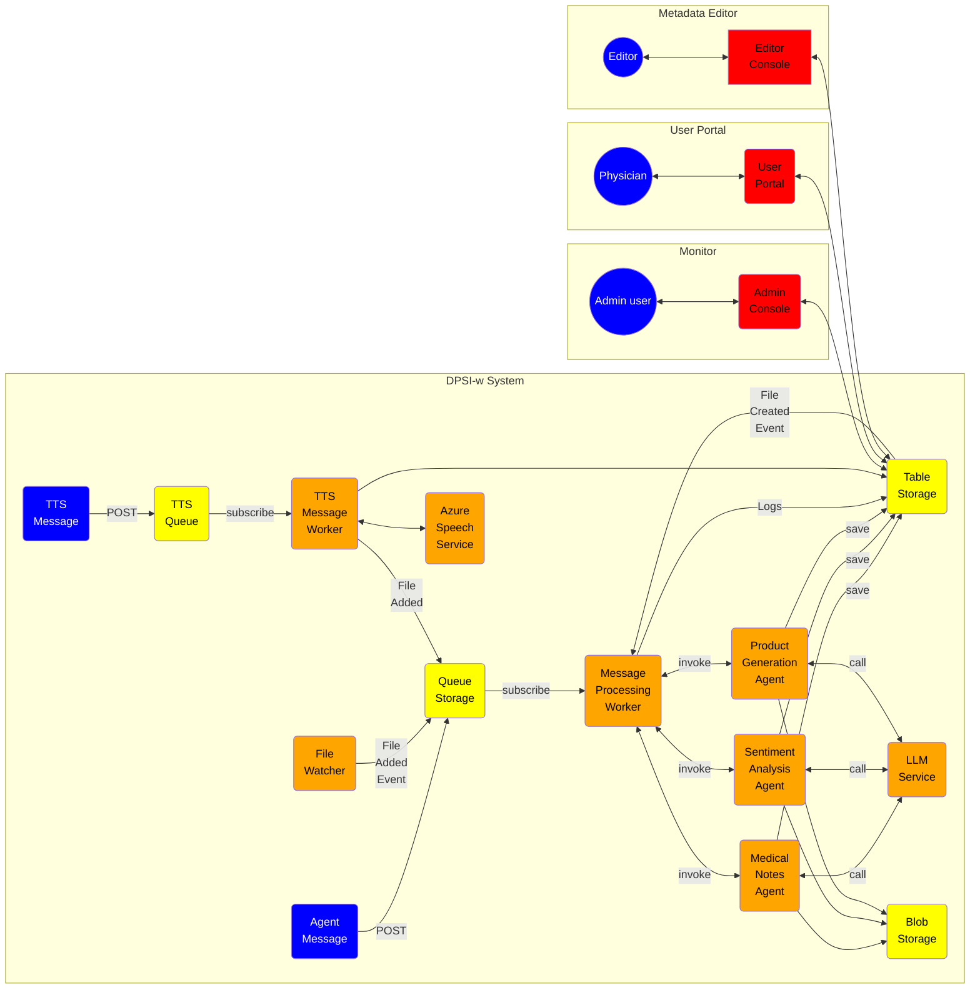

[](https://codeclimate.com/github/ZionClouds/ZionAIMedFlow-v2) [](http://20.127.153.94:9000/dashboard?id=ZionAIMedFlow-v2) [](http://20.127.153.94:9000/dashboard?id=ZionAIMedFlow-v2) [](http://20.127.153.94:9000/dashboard?id=ZionAIMedFlow-v2) [](http://20.127.153.94:9000/dashboard?id=ZionAIMedFlow-v2) [](http://20.127.153.94:9000/dashboard?id=ZionAIMedFlow-v2)

       
---
page_type: sample
languages:
- azdeveloper
- python
- bash
- bicep
products:
- azure
- azure-openai
- azure-ai-speech
- azure-ai-translation
- azure-cosmosdb
- azure-service-bus
- azure-function-apps
- azure-container-apps
- azure-storage-tables
urlFragment: datafusion-chat
name: Zion DataFusion RAG- A RAG Copilot powered by Azure AI Studio and Azure OpenAI (Python Implementation)
description: Develop, assess, and deploy a RAG-based copilot that answers customer inquiries with responses grounded in user knowledge and customer data.
---

# ZionAI MedFlow: Transforming Federal Healthcare with Intelligent Automation
ZionAI MedFlow GenAI is a secure, scalable workflow automation solution designed to modernize healthcare operations for federal agencies. Built to seamlessly integrate with existing systems, including electronic health records (EHRs), laboratory systems, and imaging tools, MedFlow intelligently manages, processes, and analyzes critical patient data in real-time, delivering improved outcomes and operational excellence.

At its core, MedFlow features a Worker module that captures and processes information from diverse data sources, ensuring compliance with stringent medical standards like HIPAA. Data is routed intelligently—updating records, triggering alerts, or scheduling follow-ups—reducing administrative burdens and improving service delivery to citizens.

Additional capabilities include a Patient Profile Loader for real-time access to comprehensive records and an automated Transcription Service for clinical note management. The Admin Console ensures continuous system monitoring, while the Physician Portal provides a user-friendly interface for instant decision-making and patient care.

Designed for adaptability, MedFlow includes a Metadata Editor that enables real-time workflow adjustments to accommodate changing operational needs. Built with federal security standards such as NIST compliance, the system ensures robust protection against vulnerabilities.

Implementation is straightforward and developer-friendly. Clone the repository, configure settings, and deploy using Visual Studio Code. Whether for healthcare modernization or broader federal enterprise needs, ZionAI MedFlow ensures rapid adoption and measurable impact on mission-critical programs.


### Architecture Diagram

<p align="center">

</p>

## Application Architecture Diagram




# Distributed Processing System For Intelligent Workloads (DPSIw)

ZionAI MedFlow’s Distributed Processing System for Intelligent Workloads (DPSIw) is a scalable and modular application designed to efficiently process and analyze diverse message streams in dynamic healthcare environments. This architecture leverages distributed components to streamline data workflows, ensuring real-time processing and actionable insights while adhering to federal compliance standards.

The system’s Worker Module captures messages from various sources, including file watchers and blob storage events, applying intelligent content filters to ensure only relevant and secure data is processed. These messages are seamlessly integrated with auxiliary services like the Metadata Loader, Profile Loader, and Transcription Service, enhancing data accuracy and operational efficiency.

Key features include a Monitor Module with an Admin Console for system oversight, a User Portal that enables secure and intuitive access for healthcare professionals, and a Metadata Editor for real-time workflow customization. Together, these components empower federal healthcare programs to reduce inefficiencies and improve citizen-centric service delivery.

The development environment is streamlined for rapid deployment using Azure Storage Emulator, requiring simple setup steps: clone the repository, configure an environment file, and establish a virtual Python environment. With compatibility for Visual Studio Code, this system ensures ease of use for agile teams tasked with delivering scalable, secure solutions.

## Features

Features Designed for Federal Healthcare Modernization
The ZionAI MedFlow project template is purpose-built to deliver advanced capabilities for healthcare transformation, leveraging secure and scalable technologies to meet the needs of federal agencies. Key features include:

- [Azure OpenAI](https://learn.microsoft.com/azure/ai-services/openai/): Enables powerful embeddings, chat interfaces, and evaluation models for intelligent data interaction.
- [Azure AI Search](https://azure.microsoft.com/products/ai-services/ai-search): Performs semantic similarity searches, ensuring fast and accurate document retrieval for mission-critical operations.
- [Azure Container Apps](https://learn.microsoft.com/azure/container-apps/overview): Provides a robust hosting environment for AI endpoints, enabling scalable and reliable application deployment.

Additionally, the project includes:

-  product and customer data for rapid prototyping, facilitating quick demonstrations and iterative development.
-  datasets and custom evaluators, enabling agencies to fine-tune solutions for specific use cases.
- Seamless integration with Azure AI Search, ensuring efficient indexing and retrieval of critical documents while maintaining compliance with federal data security standards.
These features empower federal teams to prototype, deploy, and scale solutions rapidly, ensuring high-quality service delivery to citizens and stakeholders.

## Pre-requisites

To deploy and explore the Solution, you will need:

1. An active Azure subscription - [Signup for a free account here](https://azure.microsoft.com/free/)
1. Access to Azure OpenAI Services - [Learn about Limited Access here](https://learn.microsoft.com/legal/cognitive-services/openai/limited-access)
1. Available Quota for: `text-embedding-ada-002` and `gpt-4o`

We recommend deployments to `eastus` or `swedencentral` as regions that can support all these models. In addition to the above, you will also need the ability to:
 - provision Azure Monitor (free tier)
 - provision Azure Container Apps (free tier)

From a tooling perspective, familiarity with the following is useful:
 - Visual Studio Code (and extensions)
 - Python and Jupyter Notebooks
 - Azure CLI, Azure Developer CLI and commandline usage

## Solution Deployment
The Solution illustrates the end-to-end workflow (GenAIOps) for building a RAG-based application **code-first** with Azure AI. By exploring and deploying this Product, you will need to:

1. Deploy and use [Azure OpenAI](https://learn.microsoft.com/azure/ai-services/openai/) models for chat, embeddings and evaluation
1. Host the application as a FastAPI endpoint deployed to Azure Container Apps
1. Provision and deploy the solution using the Azure Developer CLI
1. Support Responsible AI practices with content safety & assessments


## Deployment Wizard

First create an Azure Entra Service Principal that will be used for User Authentication (Easy Auth):

  ```PowerShell
  .\infra\hooks\CreateAppRegistration.ps1 -AppName app-yak
  ```

The result of the script will give you an output like this:

  ```json
  {
    "appId": "xxxxxxxx-xxxx-xxxx-xxxx-xxxxxxxxxxxx",
    "displayName": "app-yak",
    "password": "*************************************",
    "tenant": "xxxxxxxx-xxxx-xxxx-xxxx-xxxxxxxxxxxx"
  }
  ```

Save the output, it will be used during the deployment.

## Deploying through azd

Follow these steps to provision Azure resources and deploy the application code:

1. Clone this repo locally to your machine

    ```shell
    git clone https://github.com/ZionClouds/ZionDataFusionAI
    ```

1. Login to your Azure account:

    ```shell
    azd auth login --use-device-code
    ```

    ```shell
    az login --use-device-code
    ```

1. Create a new azd environment:

    ```shell
    azd env new
    ```

    Enter a name that will be used for the resource group.
    This will create a new folder in the `.azure` folder, and set it as the active environment for any calls to `azd` going forward.
1. (Optional) This is the point where you can customize the deployment by setting environment variables, in order to [use existing resources](docs/deploy_existing.md), [enable optional features (such as auth or vision)](docs/deploy_features.md), or [deploy to free tiers](docs/deploy_lowcost.md).

1. Run `azd up` - This will provision Azure resources and deploy this solution to those resources, including building the search index based on the files found in the `./data` folder.
    - **Important**: Beware that the resources created by this command will incur immediate costs, primarily from the AI Search resource. These resources may accrue costs even if you interrupt the command before it is fully executed. You can run `azd down` or delete the resources manually to avoid unnecessary spending.
    - You will be prompted to select two locations, one for the majority of resources and one for the OpenAI resource, which is currently a short list. That location list is based on the [OpenAI model availability table](https://learn.microsoft.com/azure/cognitive-services/openai/concepts/models#model-summary-table-and-region-availability) and may become outdated as availability changes.

> NOTE: It may take 5-10 minutes after you see 'SUCCESS' for the application to be fully deployed. If you see a "Python Developer" welcome screen or an error page, then wait a bit and refresh the page. See [guide on debugging App Service deployments](docs/appservice.md).

At the end run the script SetupAppRegistration.ps1 in a PowerShell session to finish the App Registration setup. Pass the parameter -AppId as the "appId" from the output of CreateAppRegistration.ps1 and -ACAFrontEndUrl from the Azure Container Apps URL it can be captured at the end of the deployment under output tabs or by browsing the resource group and looking for the Azure Container Apps with a name like "yak-xxxxxxxxxxxxx-ca":

```powershell
.\infra\hooks\SetupAppRegistration.ps1 -AppId "xxxxxxxx-xxxx-xxxx-xxxx-xxxxxxxxxxxx" -ACAFrontEndUrl "https://yak-xxxxxxxxxxxxx-ca.xxxxxxxxxxxx-xxxxxxxx.<region>.azurecontainerapps.io"
```

In case you are running from a Linux environment

```powershell
.\infra\hooks\SetupAppRegistrationLinux.ps1 -AppId "xxxxxxxx-xxxx-xxxx-xxxx-xxxxxxxxxxxx" -ACAFrontEndUrl "https://yak-xxxxxxxxxxxxx-ca.xxxxxxxxxxxx-xxxxxxxx.<region>.azurecontainerapps.io"
```

## Deployment Wizard

First create an Azure Entra Service Principal that will be used for User Authentication (Easy Auth):

## Deploying through azd

Follow these steps to provision Azure resources and deploy the application code:

1. Clone this repo locally to your machine

    ```shell
    git clone https://github.com/ZionClouds/ZionDataFusionAI
    ```

1. Login to your Azure account:

    ```shell
    azd auth login --use-device-code
    ```

    ```shell
    az login --use-device-code
    ```

1. Create a new azd environment:

    ```shell
    azd env new
    ```

    Enter a name that will be used for the resource group.
    This will create a new folder in the `.azure` folder, and set it as the active environment for any calls to `azd` going forward.
1. (Optional) This is the point where you can customize the deployment by setting environment variables, in order to [use existing resources](docs/deploy_existing.md), [enable optional features (such as auth or vision)](docs/deploy_features.md), or [deploy to free tiers](docs/deploy_lowcost.md).

1. Run `azd up` - This will provision Azure resources and deploy this Solution to those resources, including building the search index based on the files found in the `./data` folder.
    - **Important**: Beware that the resources created by this command will incur immediate costs, primarily from the AI Search resource. These resources may accrue costs even if you interrupt the command before it is fully executed. You can run `azd down` or delete the resources manually to avoid unnecessary spending.
    - You will be prompted to select two locations, one for the majority of resources and one for the OpenAI resource, which is currently a short list. That location list is based on the [OpenAI model availability table](https://learn.microsoft.com/azure/cognitive-services/openai/concepts/models#model-summary-table-and-region-availability) and may become outdated as availability changes.

> NOTE: It may take 5-10 minutes after you see 'SUCCESS' for the application to be fully deployed. If you see a "Python Developer" welcome screen or an error page, then wait a bit and refresh the page. See [guide on debugging App Service deployments](docs/appservice.md).


## Development

### Development dependecies

In development this application makes use of the Azure Storage Emulator.

- Starting the storage emulator with persistance

```bash
docker run --rm -d \
    -p 10000:10000 -p 10001:10001 -p 10002:10002 \
    -v /home/alex/containers/azurestorage:/data \
    mcr.microsoft.com/azure-storage/azurite
```

- Starting the storage emulator with persistance

```bash
docker run --rm -d \
    -p 10000:10000 -p 10001:10001 -p 10002:10002 \
    mcr.microsoft.com/azure-storage/azurite
```

### Development enviroment

- Clone the repo: `git clone https://github.com/am8850/zebra.git`
- Change directories: `cd zebra`
- create an `.env` file:

```bash
TABLE_CONNECTION_STRING=<CONNECTION_STRING>
QUEUE_CONNECTION_STRING=<CONNECTION_STRING>
STORAGE_CONNECTION_STRING=<CONNECTION_STRING>
TYPE=azure
CHAT_MODEL=gpt-4o
ENDPOINT=<ENDPOINT>
API_KEY=<API_KEY>
VERSION=2024-02-15-preview
```

- Create a Virtual Python >3.10 Enviornment: `python -m venv .venv`
- Activate the Python environment: `source .venv\bin\activate`
- Open the solution in VS Code: `code .`
- Open the file: `dpsiw/cmd/root.py`
- Hit the play button

### Full run

```bash
dpsiw qclear
dpsiw mt-rm
dpsiw produce -n "${1:-1}"
dpsiw consume
dpsiw mt-ls
```
