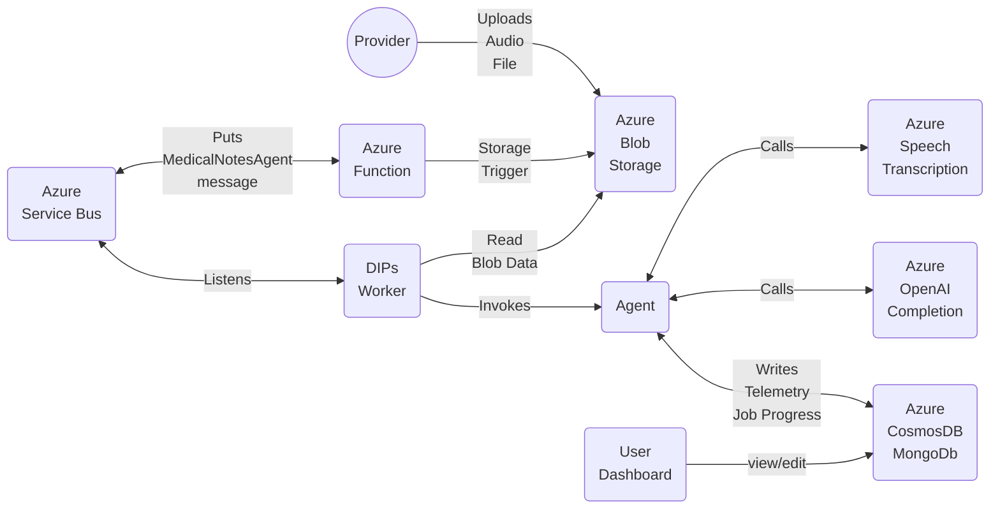
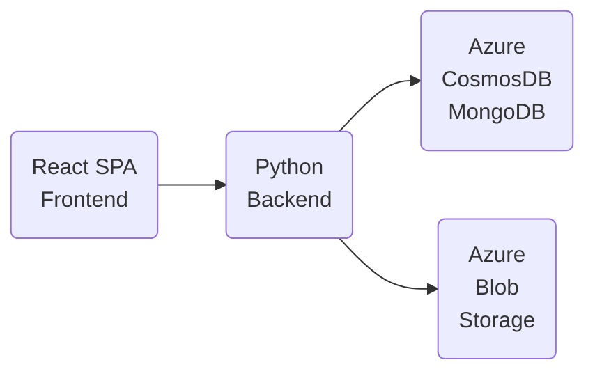

# Medical notes

## DPSiw (DIPs) Architecture Diagram



## ZionMedFlow - Frontend



## SaaS Hosting

- Shared: One environment multiple providers
  - Deploy dips to a shared environment
  - Deploy ZionMedFlow to a shared environment
  - Providers join independently
- Dedicated: One environment exclusively for a provider office
  - Providers join as a group

## Development and Debugging

### Azure Resources

- Azure Blob Storage (audio blobs and Azure functions telemetry)
  - Create a blob container called: `medical-notes-in`
- Azure MongoDB (DIPs telemetry)
- Azure OpenAI (LLM)
- Azure ServiceBus (Message queueing)
  - Create a queue called: `dips-messages`
- Azure Functions (Python/DIPs StorageTrigger)
- Azure Application Insights (telemetry Azure Functions)


### Required `src/.env` file

Please create an `src/.env` file at the root folder with the following settings:

```bash
# Storage
TABLE_CONNECTION_STRING="DefaultEndpointsProtocol=https;AccountName=<NAME>;AccountKey=<KEY>;EndpointSuffix=core.windows.net"
QUEUE_CONNECTION_STRING="DefaultEndpointsProtocol=https;AccountName=<NAME>;AccountKey=<KEY>;EndpointSuffix=core.windows.net"
STORAGE_CONNECTION_STRING="DefaultEndpointsProtocol=https;AccountName=<NAME>;AccountKey=<KEY>;EndpointSuffix=core.windows.net"

# STORAGE
STORAGE_URL=https://<NAME>.blob.core.windows.net
STORAGE_KEY="<KEY>"


# OpenaAI
TYPE=azure
CHAT_MODEL=gpt-4o
ENDPOINT=https://<NAME>.openai.azure.com/
API_KEY=<KEY>
VERSION=2024-02-15-preview

# SB
SB_SEND="Endpoint=sb://<NAME>.servicebus.windows.net/;SharedAccessKeyName=DIPS_SEND;SharedAccessKey=<KEY>;EntityPath=dips-messages"
SB_LISTEN="Endpoint=sb://<NAME>.servicebus.windows.net/;SharedAccessKeyName=DIPS_LISTEN;SharedAccessKey=<KEY>;EntityPath=dips-messages"

# Speech
SPEECH_REGION=centralus
SPEECH_API_KEY=<KEY>

# MongoDB
MONGO_DB="mongodb://<NAME>:<PWD>@mgdipsdevcus.mongo.cosmos.azure.com:10255/?ssl=true&retrywrites=false&replicaSet=globaldb&maxIdleTimeMS=120000&appName=@mgdipsdevcus@"
```
### Python Environment

- Create a Python environment at the root folder:
  - `python -m venv .venv`
- Activate the environment:
  - `source .venv\bin\activate`
- Navigate to `src`
- Install the requirements: `pip install -r requirements.txt`

### DIPs - Python

- Navigate to `src`
- Install DIPs as a CLI: `sh setup.sh`
- Make sure the Python environment is activated
- Open: dpsiw\cmd\root.py
- To debug the `consume()` path, change the following lines:

```python
if __name__ == "__main__":
    cli()

# To

if __name__ == "__main__":
    consume()
```

### Test message

```
#alias dips=dpsiw
dpsiw produce
dpsiw consume
```

### DIPs - Azure Function

This Azure function monitor a Blob storage container and when a user adds a blobk it create a message that is put on the Azure servicebus.

- Follow the instruction to install Azure Functions Core Tools
  - [Instructions](https://learn.microsoft.com/en-us/azure/azure-functions/create-first-function-cli-python?tabs=linux%2Cbash%2Cazure-cli%2Cbrowser)
- You may also want to install the Azure Functions and Azure Storage VS Code extensions

#### Create a local `local.settings.json`

- At `azfuncs\AzFuncsDips` create `local.settings.json`:

```json
{
  "IsEncrypted": false,
  "Values": {
    "FUNCTIONS_WORKER_RUNTIME": "python",
    "AzureWebJobsFeatureFlags": "EnableWorkerIndexing",
    "AzureWebJobsStorage": "<CONNECTION_STRING>"
  }
}
```

> **Note:** The connection string should be similar to the one above for .env STORAGE_CONNECTION_STRING

#### Debugging Azure Function Locally

- Open the azfuncs\AzFuncsDips in VS Code in a new window
- The Azure Function extension creates its own `.venv` Python environment
- It also creates a VS Code debugging configuration
- Start the debugger by pressing: `F5`
- To test the trigger, upload an audio file to: `blob storage\medical-notes-in`

### MyMedical Notes

#### Python Backend

- Open: `MyMDNotes\backend\appp.py`
- Make sure the Python environment is activated
- Start the debugger

#### Frontend

> Note: I switched from using NPM to using [bun.sh](https://bun.sh/).

- Install the packages:
  - `npm install` or `bun install`
- Launch the site:
  - `bun run dev`
