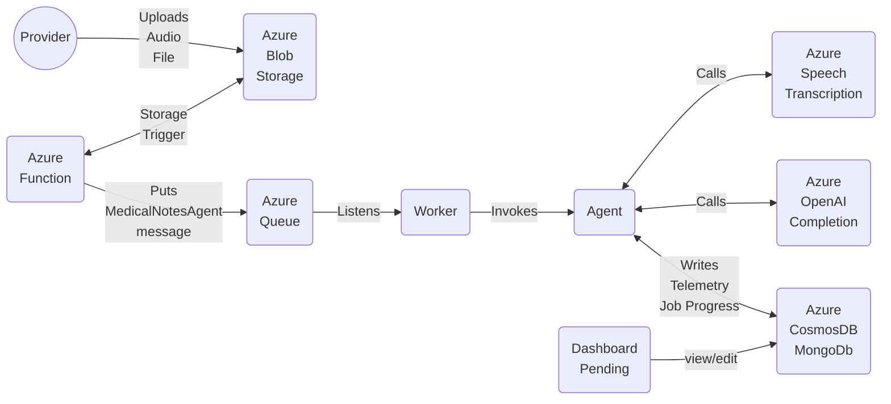

# Medical notes

```mermaid
graph LR
  P((Provider))--Uploads<br>Audio<br>File-->S(Azure<br>Blob<br/>Storage)

  Az(Azure<br>Function)<--Storage<br/>Trigger-->S
  Az--Puts<br/>MedicalNotesAgent<br/>message-->Q(Azure<br/>Queue)
  
  Q--Listens-->W(Worker)
  W--Invokes-->A(Agent)
  A<--Calls-->SP(Azure<br>Speech<br>Transcription)
  A<--Calls-->O(Azure<br/>OpenAI<br>Completion)
  A<--Writes<br/>Telemetry<br/>Job Progress-->M(Azure<br/>CosmosDB<br/>MongoDb)
  D(Dashboard<br>Pending)--view/edit-->M

```